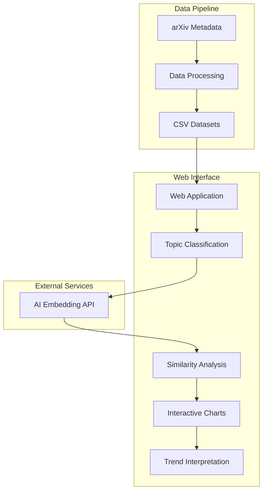

# TopicTrends

A web-based research paper analysis tool that uses AI-powered topic classification to identify and visualize emerging research trends across different academic fields.

## Overview

TopicTrends helps publishers, researchers, and analysts identify emerging research areas and track how topics evolve over time. The application processes arXiv research papers, classifies them using semantic similarity, and provides interactive visualizations of topic trends over time.

## Architecture



## Features

- **Multi-Domain Analysis**: Support for Quantitative Biology, Quantitative Finance, and Statistics research papers
- **AI-Powered Classification**: Uses OpenAI's text-embedding-3-small model for semantic similarity analysis
- **Interactive Visualizations**: Dynamic charts showing topic trends over time
- **Customizable Topics**: User-defined topic categories for targeted analysis
- **Similarity Threshold Control**: Adjustable precision for topic classification
- **Trend Interpretation**: AI-powered analysis of identified trends
- **Document Inspection**: Detailed view of papers within each topic category

## Technology Stack

- **Frontend**: HTML5, CSS3, JavaScript (ES6+)
- **UI Framework**: Bootstrap 5.3.6
- **Data Visualization**: D3.js v7
- **AI Integration**: AsyncLLM for embedding similarity
- **Data Processing**: Python 3.11+, Pandas, PyArrow
- **Data Source**: arXiv metadata snapshot

## Installation

### Prerequisites

- Python 3.11 or higher
- Web browser with JavaScript enabled
- Access to arXiv metadata (download from Kaggle)

### Setup

1. Clone the repository:
```bash
git clone https://github.com/sanand0/topictrends.git
cd topictrends
```
2. Download the arXiv metadata:
   - Visit [arXiv Dataset on Kaggle](https://www.kaggle.com/datasets/Cornell-University/arxiv/)
   - Download `arxiv-metadata-oai-snapshot.json.zip`
   - Place it in the project root directory

3. Process the data:
```bash
uv run scrape.py
```

4. Serve the application:
```bash
# Using Python's built-in server
python -m http.server 8000

# Or using any other web server
```

5. Open your browser and navigate to `http://localhost:8000`

## Usage

1. **Select a Dataset**: Choose from available research domains (Quantitative Biology, Quantitative Finance, or Statistics)

2. **Configure Topics**: Edit the predefined topics or add your own custom topics for analysis

3. **Classify Documents**: Click "Classify" to process the papers using AI-powered semantic similarity

4. **Adjust Threshold**: Use the similarity threshold slider to control classification precision

5. **Analyze Trends**: View interactive charts showing topic popularity over time

6. **Interpret Results**: Use the AI interpretation feature to get insights about the trends

## Data Structure

The application processes CSV files containing the following fields:
- `id`: arXiv paper identifier
- `update_date`: Publication/update date
- `title`: Paper title
- `abstract`: Paper abstract

## Configuration

The `config.json` file defines available datasets and their associated topics:

```json
{
  "demos": [
    {
      "name": "Quantitative Biology - Others",
      "icon": "streamline:bacteria-virus-cells-biology",
      "file": "q-bio.OT.csv",
      "topics": [
        "Pandemic Influenza and COVID-19 Dynamics",
        "Global Bioimage Data Sharing",
        "Microfluidics and Lab-on-a-Chip Technologies"
      ]
    }
  ]
}
```

## API Integration

The application integrates with an external embedding similarity API:
- **Endpoint**: `https://llmfoundry.straive.com/similarity`
- **Model**: `text-embedding-3-small`
- **Method**: POST with JSON payload containing documents and topics

## Contributing

1. Fork the repository
2. Create a feature branch (`git checkout -b feature/amazing-feature`)
3. Commit your changes (`git commit -m 'Add amazing feature'`)
4. Push to the branch (`git push origin feature/amazing-feature`)
5. Open a Pull Request

## License

This project is licensed under the MIT License - see the [LICENSE](LICENSE) file for details.

## Acknowledgments

- arXiv for providing the research paper metadata
- OpenAI for the text embedding models
- D3.js community for the visualization library
- Bootstrap team for the UI framework

## Support

For issues and questions, please open an issue on the GitHub repository. 